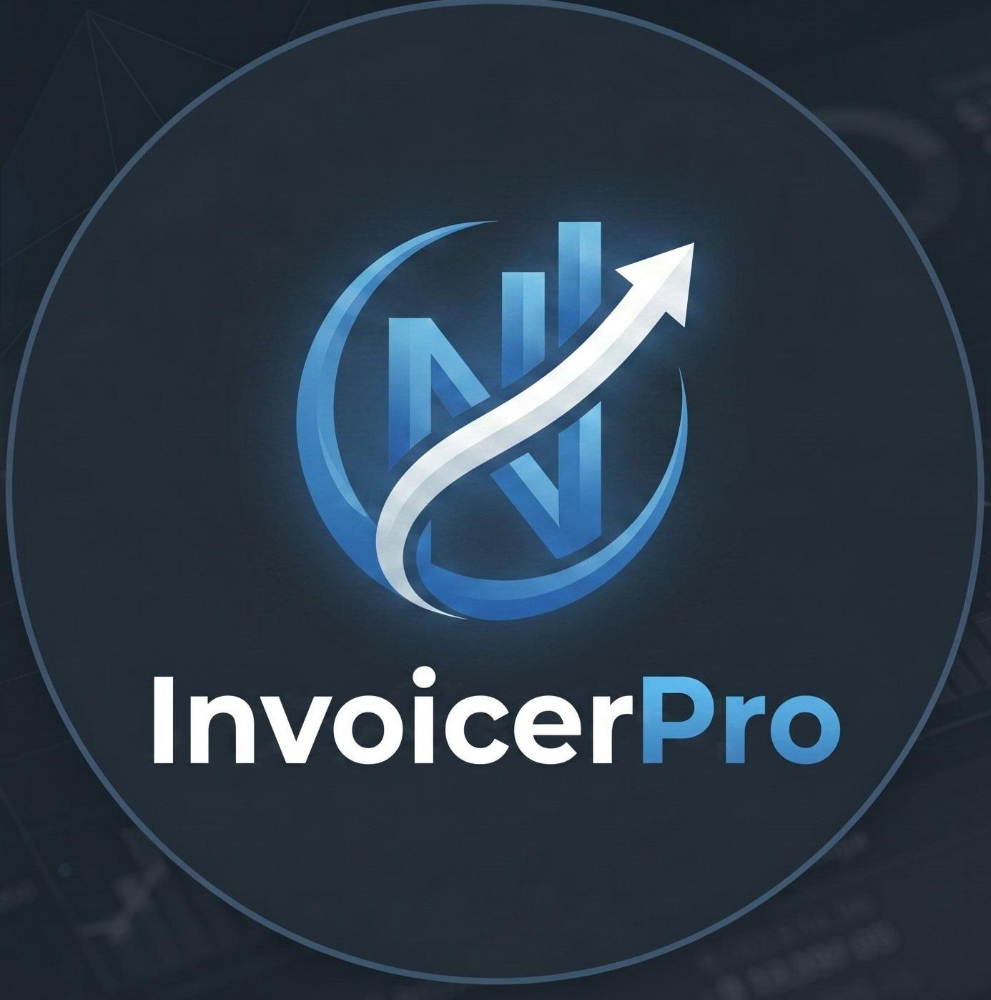

<div align="center">



# InvoicerPro

**Professional invoice management powered by AI — built for freelancers and small businesses.**

[](https://reactjs.org)
[](https://nodejs.org)
[](https://mongodb.com)
[](https://docker.com)
[](https://aistudio.google.com)
[](https://github.com/features/actions)
[](LICENSE)

### 🚀 [Live Demo](https://invoicer-pro-nine.vercel.app) · [Backend API](https://invoicerpro-server.onrender.com)

[Features](#features) · [AI Features](#ai-features) · [Tech Stack](#tech-stack) · [Getting Started](#getting-started) · [Docker](#docker) · [CI/CD](#cicd) · [Roadmap](#roadmap)

</div>

---

## Overview

InvoicerPro is a production-ready full-stack MERN application for creating, sending, and tracking professional invoices. It includes PDF generation, email delivery, client management, a live revenue dashboard, and an **AI assistant powered by Google Gemini** — all deployed with Docker and automated CI/CD.

> **Live at:** https://invoicer-pro-nine.vercel.app
> **API:** https://invoicerpro-server.onrender.com

---

## Features

- **Invoice Management** — Create, edit, and delete invoices with line items, discounts, VAT, and multi-currency support
- **PDF Generation** — Generate professional PDF invoices and download or email them instantly
- **Email Delivery** — Send invoices directly to clients via Nodemailer with professional email templates
- **Client Management** — Maintain a client directory with contact details linked to invoices
- **Revenue Dashboard** — Visualise paid, unpaid, and overdue amounts with Recharts + ApexCharts
- **Payment Tracking** — Record partial and full payments against any invoice
- **Authentication** — Google OAuth 2.0 and email/password login with JWT
- **Password Reset** — Secure token-based password reset via email
- **AI Assistant** — Google Gemini powered chat, smart reminders, and expense categorization
- **Docker + CI/CD** — Fully containerized, auto-deployed via GitHub Actions

---

## AI Features

Dedicated **/ai-assistant** page powered by **Google Gemini**:

### 💬 AI Chat Assistant
Ask anything about your invoices — overdue counts, revenue summaries, business tips. The AI has full context of your live invoice data.

### 🔔 Smart Payment Reminders
Select any unpaid invoice → AI writes a professional reminder email with tone adjusted automatically based on days overdue (friendly → urgent → firm).

### 🏷️ Auto Expense Categorizer
Select any invoice → AI categorizes all line items into standard business categories (Software, Marketing, Consulting, etc.) with confidence scores.

---

## Tech Stack

### Frontend
| Library | Purpose |
|---|---|
| React 17 | UI framework |
| Redux | Global state management |
| React Router v5 | Client-side routing |
| Material UI v4 | Component library |
| Recharts + ApexCharts | Dashboard charts |
| Axios | HTTP client |
| file-saver | PDF download |

### Backend
| Library | Purpose |
|---|---|
| Node.js + Express | REST API server |
| MongoDB + Mongoose 7 | Database and ODM |
| html-pdf-node | PDF generation |
| Nodemailer | Transactional email |
| JSON Web Tokens | Authentication |
| bcrypt | Password hashing |
| Google Gemini API | AI features |

### DevOps
| Tool | Purpose |
|---|---|
| Docker + Docker Compose | Containerization |
| GitHub Actions | CI/CD pipeline |
| Nginx | Frontend reverse proxy |
| Render | Backend deployment |
| Vercel | Frontend deployment |
| MongoDB Atlas | Cloud database |

---

## Getting Started

### Prerequisites
- Node.js 16+
- MongoDB (local or [Atlas](https://cloud.mongodb.com))
- SMTP credentials (Gmail, etc.)
- [Google Gemini API key](https://aistudio.google.com) — free
- Google OAuth Client ID — optional

### 1. Clone
```bash
git clone https://github.com/Navneet-pratap1027/Invoicer_Pro.git
cd Invoicer_Pro
```

### 2. Server setup
```bash
cd server
npm install
```

Create `server/.env`:
```env
DB_URL=your_mongodb_connection_string
SECRET=your_jwt_secret

SMTP_HOST=smtp.gmail.com
SMTP_PORT=587
SMTP_USER=your_email@gmail.com
SMTP_PASS=your_app_password

GEMINI_API_KEY=your_gemini_api_key
PORT=5000
```

```bash
npm start
```

### 3. Client setup
```bash
cd client
npm install --legacy-peer-deps
```

Create `client/.env`:
```env
REACT_APP_API=http://localhost:5000
REACT_APP_URL=http://localhost:3000
REACT_APP_GOOGLE_CLIENT_ID=your_google_client_id
DISABLE_ESLINT_PLUGIN=true
```

```bash
npm start
```

---

## Docker

Run the full stack locally with one command:

```bash
docker-compose up --build
```

Starts MongoDB + Node.js server + React client together.

---

## CI/CD

Every `git push` to `main` triggers the GitHub Actions pipeline:

```
git push → GitHub Actions
              ├── Install & build client
              ├── Build Docker image
              ├── Push to Docker Hub
              └── Deploy to Render
```

Vercel auto-deploys the frontend on every push automatically.

---

## Environment Variables

### Server
| Variable | Required | Description |
|---|---|---|
| `DB_URL` | ✅ | MongoDB connection string |
| `SECRET` | ✅ | JWT signing secret |
| `SMTP_HOST` | ✅ | SMTP hostname |
| `SMTP_PORT` | ✅ | SMTP port (587) |
| `SMTP_USER` | ✅ | SMTP email |
| `SMTP_PASS` | ✅ | SMTP password |
| `GEMINI_API_KEY` | ✅ | Google Gemini API key |
| `PORT` | ➖ | Defaults to 5000 |

### Client
| Variable | Required | Description |
|---|---|---|
| `REACT_APP_API` | ✅ | Backend API URL |
| `REACT_APP_URL` | ✅ | Frontend URL |
| `REACT_APP_GOOGLE_CLIENT_ID` | ➖ | Google OAuth Client ID |

---

## Project Structure

```
Invoicer_Pro/
├── .github/workflows/deploy.yml   # CI/CD pipeline
├── client/                        # React frontend
│   ├── src/components/
│   │   ├── AI/                    # AI Assistant features
│   │   ├── Dashboard/
│   │   ├── Invoice/
│   │   ├── InvoiceDetails/
│   │   ├── NavBar/
│   │   └── Settings/
│   ├── Dockerfile
│   └── nginx.conf
├── server/                        # Express backend
│   ├── controllers/ai.js          # Gemini AI logic
│   ├── documents/                 # PDF & email templates
│   ├── models/                    # Mongoose schemas
│   ├── routes/ai.js               # AI endpoints
│   ├── middleware/
│   └── Dockerfile
├── docker-compose.yml
└── render.yaml
```

---

## Roadmap

Future improvements planned:

- [ ] Stripe payment integration
- [ ] Multi-language invoice support
- [ ] Recurring invoice scheduling
- [ ] AI invoice data extraction from images (OCR)
- [ ] Mobile app (React Native)
- [ ] AWS EC2 deployment with full DevOps pipeline

---

## Known Issues & Fixes

| Issue | Status | Fix Applied |
|---|---|---|
| Puppeteer failing on Render free tier | ✅ Fixed | Replaced with `html-pdf-node` |
| Gemini API quota exceeded | ✅ Fixed | Created fresh API project |
| `framer-motion` peer dependency conflict | ✅ Fixed | Using `--legacy-peer-deps` |
| Google OAuth `origin_mismatch` on deploy | ✅ Fixed | Added Vercel URL to Google Console |
| NavBar labels clipping | ✅ Fixed | CSS module with hover expand |

---

## Security

- JWT auth middleware on all protected routes
- Passwords hashed with bcrypt (12 rounds)
- Token expiry enforced client and server side
- Input validation on all endpoints
- CORS configured
- `.env` files never committed

---

## Contributing

Pull requests are welcome. For major changes, open an issue first.

---

## License

[MIT](LICENSE) © 2026 Navneet Pratap
